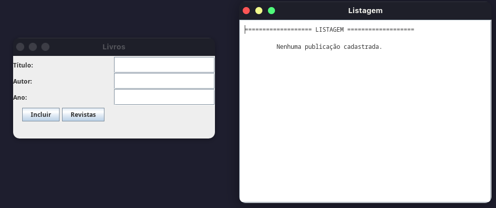
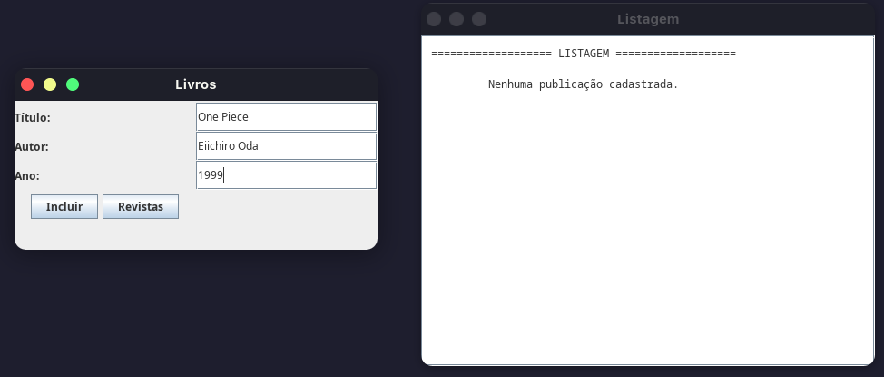
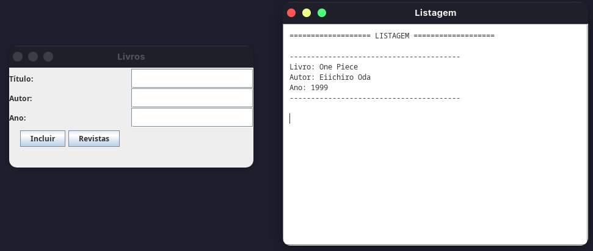
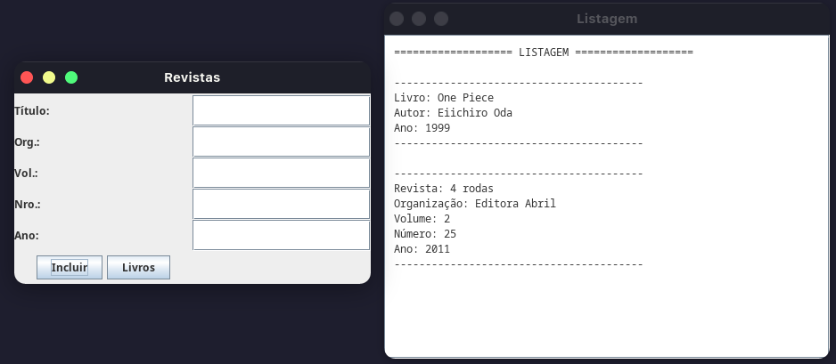

# Sistema de Controle de Biblioteca

Sistema para gerenciar o cadastro de livros e revistas em uma biblioteca, utilizando Java e interface gráfica Swing.

#### Organização do Código-Fonte

A estrutura do projeto foi organizada da seguinte forma:

#### Classes Principais

##### Publicacao
Classe base abstrata que define os atributos comuns para livros e revistas.

```java
public class Publicacao {
    protected String titulo;
    protected String editora;
    protected int ano;

    public Publicacao(String titulo, String editora, int ano) {
        this.titulo = titulo;
        this.editora = editora;
        this.ano = ano;
    }

    public String getInfo() {
        return "Título: " + titulo +
                "\nEditora: " + editora +
                "\nAno: " + ano;
    }
}
```

##### Livro
Classe que representa um livro no sistema, herda a classe `Publicacao`. Adiciona funcionalidades específicas para gerenciamento de livros, como autor e ISBN.

```java
public class Livro extends Publicacao {
    private String autor;
    private String isbn;

    public Livro(String titulo, String editora, int ano, String autor, String isbn) {
        super(titulo, editora, ano);
        this.autor = autor;
        this.isbn = isbn;
    }

    @Override
    public String getInfo() {
        return "Livro: " + titulo + 
               "\nAutor: " + autor + 
               "\nEditora: " + editora +
               "\nAno: " + ano +
               "\nISBN: " + isbn;
    }

    public String getAutor() {
        return autor;
    }

    public String getIsbn() {
        return isbn;
    }
}
```

##### Revista
Classe que representa uma revista no sistema, herda a classe `Publicacao`. Adiciona funcionalidades específicas para gerenciamento de revistas, como ISSN, número, organizador e volume.

```java
public class Revista extends Publicacao {
    private String issn;
    private int numero;
    private String organizador;
    private int volume;

    public Revista(String titulo, String editora, int ano, String issn, int numero, String organizador, int volume) {
        super(titulo, editora, ano);
        this.issn = issn;
        this.numero = numero;
        this.organizador = organizador;
        this.volume = volume;
    }

    @Override
    public String getInfo() {
        return "Revista: " + titulo + " Org:" + organizador + " Vol:" + volume + 
               " Nro:" + numero + " Ano:" + ano;
    }

    public String getOrganizador() {
        return organizador;
    }

    public int getVolume() {
        return volume;
    }

    public int getNumero() {
        return numero;
    }
}
```

##### ControleBiblioteca
Classe responsável pelo gerenciamento das publicações no sistema. Implementa as operações principais de controle do acervo da biblioteca.

```java
import java.util.ArrayList;
import java.util.List;

public class ControleBiblioteca {
    private List<Publicacao> publicacoes;

    public ControleBiblioteca() {
        publicacoes = new ArrayList<>();
        System.out.println("ControleBiblioteca iniciado");
    }

    public void adicionarPublicacao(Publicacao publicacao) {
        if (publicacao != null) {
            publicacoes.add(publicacao);
            System.out.println("Publicação adicionada com sucesso:");
            System.out.println(publicacao.getInfo());
            System.out.println("Total de publicações: " + publicacoes.size());
        } else {
            System.out.println("Erro: Tentativa de adicionar publicação nula");
        }
    }

    public List<Publicacao> listarPublicacoes() {
        System.out.println("Listando publicações. Total: " + publicacoes.size());
        return new ArrayList<>(publicacoes);
    }

    public void imprimirTodasPublicacoes() {
        System.out.println("\n=== TODAS AS PUBLICAÇÕES ===");
        if (publicacoes.isEmpty()) {
            System.out.println("Nenhuma publicação cadastrada");
        } else {
            for (Publicacao pub : publicacoes) {
                System.out.println(pub.getInfo());
            }
        }
        System.out.println("=========================\n");
    }
}
```

**Principais características:**
- Mantém uma lista de todas as publicações cadastradas no sistema
- Utiliza polimorfismo para armazenar tanto livros quanto revistas na mesma coleção
- Métodos para:
  - Adicionar novas publicações
  - Listar todas as publicações
  - Imprimir informações  de todas as publicações

##### ControleBibliotecaGUI
Classe responsável pela interface gráfica do sistema, implementando todas as telas e interações com o usuário utilizando a biblioteca Swing.

```java
import javax.swing.*;
import java.awt.*;

public class ControleBibliotecaGUI {
    private ControleBiblioteca controle;
    private JFrame frameLivros;
    private JFrame frameRevistas;
    private JFrame frameListagem;
    private JTextArea areaListagem;
    
    public ControleBibliotecaGUI() {
        controle = new ControleBiblioteca();
        criarTelaLivros();
        criarTelaRevistas();
        criarTelaListagem();
    }

    private void criarTelaLivros() {
        frameLivros = new JFrame("Livros");
        frameLivros.setLayout(new GridLayout(5, 2));
        
        JTextField txtTitulo = new JTextField();
        JTextField txtAutor = new JTextField();
        JTextField txtAno = new JTextField();
        
        frameLivros.add(new JLabel("Título:"));
        frameLivros.add(txtTitulo);
        frameLivros.add(new JLabel("Autor:"));
        frameLivros.add(txtAutor);
        frameLivros.add(new JLabel("Ano:"));
        frameLivros.add(txtAno);
        
        JButton btnIncluir = new JButton("Incluir");
        JButton btnRevistas = new JButton("Revistas");
        JButton btnListagem = new JButton("Listagem");
        
        JPanel painelBotoes = new JPanel();
        painelBotoes.add(btnIncluir);
        painelBotoes.add(btnRevistas);
        painelBotoes.add(btnListagem);
        
        frameLivros.add(painelBotoes);
        
        btnIncluir.addActionListener(e -> {
            if (txtTitulo.getText().trim().isEmpty() || 
                txtAutor.getText().trim().isEmpty() || 
                txtAno.getText().trim().isEmpty()) {
                JOptionPane.showMessageDialog(frameLivros, "Por favor, preencha todos os campos!");
                return;
            }

            Livro livro = new Livro(
                txtTitulo.getText().trim(),
                "Editora",
                Integer.parseInt(txtAno.getText().trim()),
                txtAutor.getText().trim()
            );
            
            controle.adicionarPublicacao(livro);
            limparCampos(txtTitulo, txtAutor, txtAno);
            atualizarListagem();
        });
        
        btnRevistas.addActionListener(e -> {
            frameLivros.setVisible(false);
            frameRevistas.setVisible(true);
        });
        
        configurarBotaoListagem(btnListagem);
        
        frameLivros.setSize(400, 200);
        frameLivros.setDefaultCloseOperation(JFrame.EXIT_ON_CLOSE);
        frameLivros.setVisible(true);
    }

    private void criarTelaRevistas() {
        frameRevistas = new JFrame("Revistas");
        frameRevistas.setLayout(new GridLayout(6, 2));
        
        JTextField txtTitulo = new JTextField();
        JTextField txtOrg = new JTextField();
        JTextField txtVol = new JTextField();
        JTextField txtNro = new JTextField();
        JTextField txtAno = new JTextField();
        
        frameRevistas.add(new JLabel("Título:"));
        frameRevistas.add(txtTitulo);
        frameRevistas.add(new JLabel("Org.:"));
        frameRevistas.add(txtOrg);
        frameRevistas.add(new JLabel("Vol.:"));
        frameRevistas.add(txtVol);
        frameRevistas.add(new JLabel("Nro.:"));
        frameRevistas.add(txtNro);
        frameRevistas.add(new JLabel("Ano:"));
        frameRevistas.add(txtAno);
        
        JButton btnIncluir = new JButton("Incluir");
        JButton btnLivros = new JButton("Livros");
        JButton btnListagem = new JButton("Listagem");
        
        JPanel painelBotoes = new JPanel();
        painelBotoes.add(btnIncluir);
        painelBotoes.add(btnLivros);
        painelBotoes.add(btnListagem);
        
        frameRevistas.add(painelBotoes);
        
        btnIncluir.addActionListener(e -> {
            if (txtTitulo.getText().trim().isEmpty() || 
                txtOrg.getText().trim().isEmpty() || 
                txtVol.getText().trim().isEmpty() || 
                txtNro.getText().trim().isEmpty() || 
                txtAno.getText().trim().isEmpty()) {
                JOptionPane.showMessageDialog(frameRevistas, "Por favor, preencha todos os campos!");
                return;
            }

            Revista revista = new Revista(
                txtTitulo.getText().trim(),
                "Editora",
                Integer.parseInt(txtAno.getText().trim()),
                "ISSN",
                Integer.parseInt(txtNro.getText().trim()),
                txtOrg.getText().trim(),
                Integer.parseInt(txtVol.getText().trim())
            );
            
            controle.adicionarPublicacao(revista);
            limparCampos(txtTitulo, txtOrg, txtVol, txtNro, txtAno);
            atualizarListagem();
        });
        
        btnLivros.addActionListener(e -> {
            frameRevistas.setVisible(false);
            frameLivros.setVisible(true);
        });
        
        configurarBotaoListagem(btnListagem);
        
        frameRevistas.setSize(400, 250);
        frameRevistas.setDefaultCloseOperation(JFrame.EXIT_ON_CLOSE);
    }

    private void criarTelaListagem() {
        frameListagem = new JFrame("Listagem");
        areaListagem = new JTextArea(20, 40);
        areaListagem.setEditable(false);
        areaListagem.setBorder(BorderFactory.createEmptyBorder(10, 10, 10, 10));
        
        JScrollPane scrollPane = new JScrollPane(areaListagem);
        frameListagem.add(scrollPane);
        
        frameListagem.setSize(500, 400);
        frameListagem.setLocation(410, 0);
        frameListagem.setDefaultCloseOperation(JFrame.DISPOSE_ON_CLOSE);
        frameListagem.setVisible(true);
        
        atualizarListagem();
    }

    private void atualizarListagem() {
        java.util.List<Publicacao> pubs = controle.listarPublicacoes();
        
        StringBuilder sb = new StringBuilder();
        sb.append("=================== LISTAGEM ===================\n\n");
        
        if (pubs.isEmpty()) {
            sb.append("         Nenhuma publicação cadastrada.\n");
        } else {
            for (Publicacao pub : pubs) {
                if (pub instanceof Livro) {
                    sb.append("----------------------------------------\n");
                    sb.append(String.format("Livro: %s\n", pub.titulo));
                    sb.append(String.format("Autor: %s\n", ((Livro) pub).getAutor()));
                    sb.append(String.format("Ano: %d\n", pub.ano));
                } else if (pub instanceof Revista) {
                    Revista rev = (Revista) pub;
                    sb.append("----------------------------------------\n");
                    sb.append(String.format("Revista: %s\n", rev.titulo));
                    sb.append(String.format("Organização: %s\n", rev.getOrganizador()));
                    sb.append(String.format("Volume: %d\n", rev.getVolume()));
                    sb.append(String.format("Número: %d\n", rev.getNumero()));
                    sb.append(String.format("Ano: %d\n", rev.ano));
                }
                sb.append("----------------------------------------\n\n");
            }
        }
        
        if (areaListagem != null) {
            areaListagem.setFont(new Font("Monospaced", Font.PLAIN, 12));
            areaListagem.setText(sb.toString());
            frameListagem.setVisible(true);
            frameListagem.toFront();
        }
    }

    private void configurarBotaoListagem(JButton btnListagem) {
        btnListagem.addActionListener(e -> {
            atualizarListagem();
            frameListagem.setVisible(true);
            frameListagem.toFront();
        });
    }

    private void limparCampos(JTextField... campos) {
        for (JTextField campo : campos) {
            campo.setText("");
        }
    }
}
```

**Principais características:**
- Possui três telas principais:
  - Tela de cadastro de livros
  - Tela de cadastro de revistas
  - Tela de listagem de publicações
- Funcionalidades principais:
  - Formulários de entrada com validação de campos
  - Navegação entre telas através de botões
  - Visualização em tempo real das publicações cadastradas
  - Interface responsiva com GridLayout
- Características :
  - Utiliza componentes Swing (JFrame, JTextField, JButton, etc.)

#### Decisões de Implementação
- Utilizei herança para evitar duplicação de código entre Livro e Revista
- Implementei validações nos construtores para garantir dados consistentes
- Separei a interface gráfica em painéis distintos para melhor organização

#### Possíveis Melhorias e Reflexões
Durante o desenvolvimento, identifiquei alguns pontos que poderiam ser aprimorados e dificuldades encontradas:

1. Algumas classes ficaram com muitas responsabilidades.
2. A validação de dados pode ser melhor estruturada, mas tive dificuldade em implementar um sistema mais complexo.
3. O código da interface gráfica poderia ser melhor modularizado, mas minha falta de experiência com Swing se mostrou uma grande limitação.
4. Tive desafios em implementar uma arquitetura mais limpa devido ao meu conhecimento aind limitado em padrões de projeto.

#### Screenshots da Execução
Abaixo estão as capturas de tela do sistema em funcionamento:

Tela Principal:  


Tela de cadastro de Livros:  


Tela de cadastro de Revistas:  


Tela com as listagens:  



### Como Executar
1. Clone o repositório
2. Abra em sua IDE Java 
3. Execute a classe `Main.java`

### Requisitos
- Java 8 ou superior
- IDE com suporte a GUI (Swing)

---
Desenvolvido por Matheus Medrado Ferreira - Princípios e Padrões de Projetos


